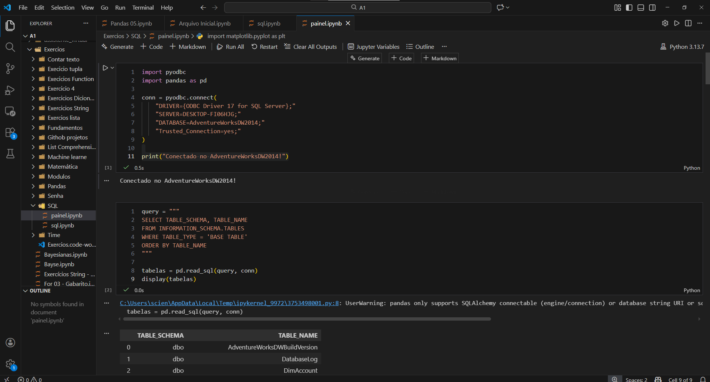
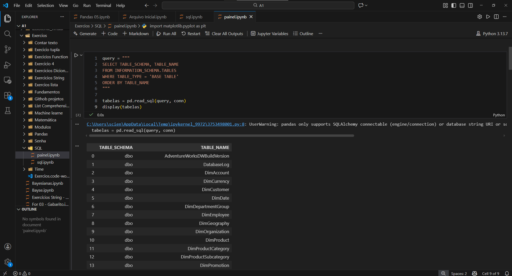
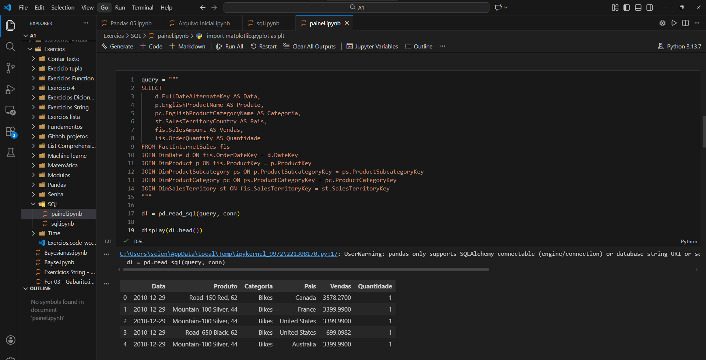
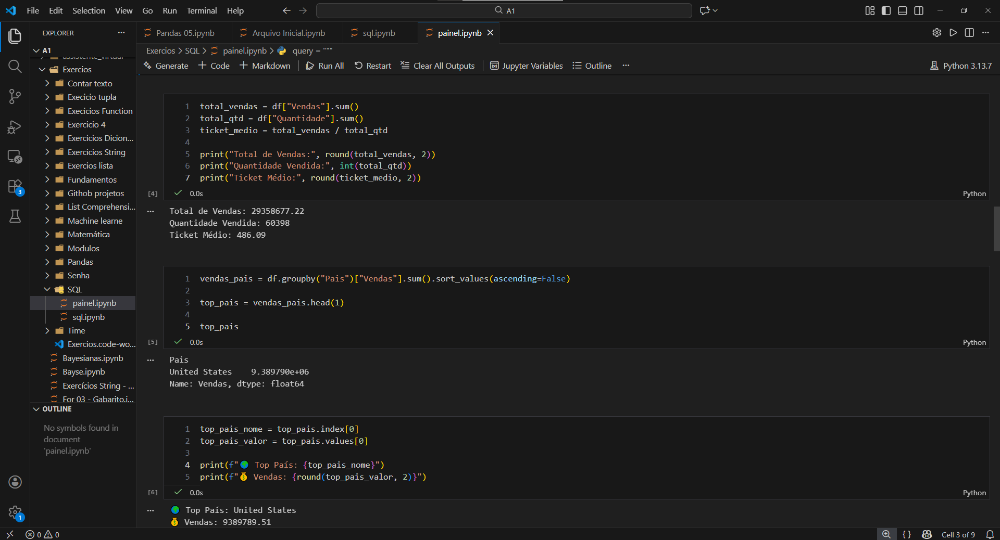
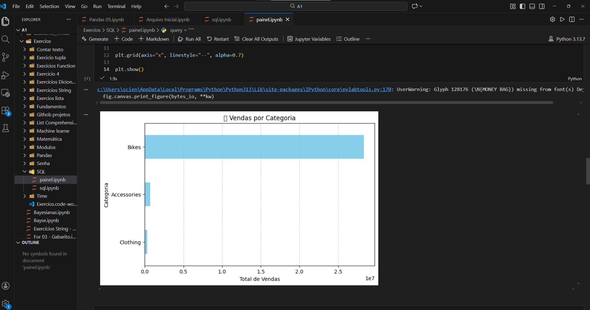
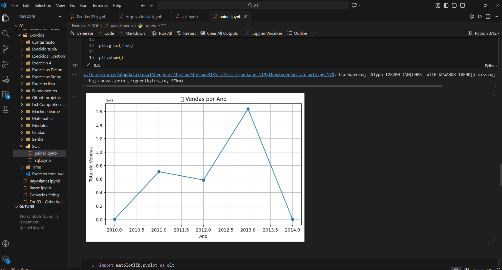
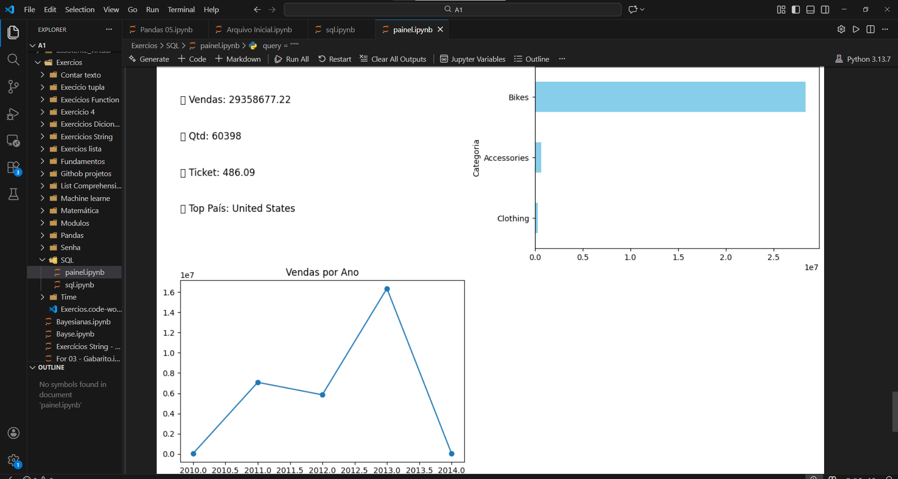

# Dashboard de Vendas com SQL Server, Python e Matplotlib

Projeto de análise de dados utilizando **SQL Server**, **Python**, **Pandas** e **Matplotlib** para construir um dashboard de vendas a partir do banco **AdventureWorksDW2014**.

O objetivo foi reproduzir, em Python, a lógica de um dashboard analítico semelhante ao que seria construído em ferramentas como Power BI, explorando desde a conexão com o banco até a criação de KPIs e visualizações.

---

## Tecnologias utilizadas

- Python
- SQL Server
- Pandas
- Matplotlib
- Jupyter Notebook
- pyodbc

---

## Objetivos do projeto

- Conectar Python ao SQL Server
- Consultar dados do banco AdventureWorksDW2014
- Relacionar tabelas fato e dimensão
- Construir um dataset analítico
- Criar KPIs de vendas
- Gerar gráficos de apoio à tomada de decisão
- Organizar tudo em um painel visual no notebook

---

## Base de dados utilizada

Banco utilizado: **AdventureWorksDW2014**

Principais tabelas exploradas:

- `FactInternetSales`
- `DimDate`
- `DimProduct`
- `DimProductSubcategory`
- `DimProductCategory`
- `DimSalesTerritory`

---

## Etapas do projeto

### 1. Conexão com o banco SQL Server
Foi realizada a conexão entre Python e SQL Server utilizando `pyodbc`.



---

### 2. Consulta das tabelas do banco
Foi feita a inspeção da estrutura do banco para identificar as tabelas fato e dimensão relevantes para o dashboard.



---

### 3. Construção da query analítica
Foi criada uma consulta SQL com joins entre tabelas para montar a base analítica usada no painel.

Campos principais:
- Data
- Produto
- Categoria
- País
- Vendas
- Quantidade



---

### 4. Criação dos KPIs
Foram calculados indicadores principais:

- **Total de Vendas**
- **Quantidade Vendida**
- **Ticket Médio**
- **País com maior volume de vendas**



---

### 5. Visualização: vendas por categoria
Gráfico horizontal com o total de vendas por categoria de produto.

**Insight:** a categoria **Bikes** concentra a maior parte do faturamento.



---

### 6. Visualização: vendas por ano
Gráfico de linha mostrando a evolução das vendas ao longo do tempo.

**Insight:** houve crescimento até 2013, seguido de queda em 2014, indicando possível base incompleta ou mudança de cenário.



---

### 7. Dashboard final
Os KPIs e gráficos foram organizados em um painel único no notebook, simulando a estrutura visual de um dashboard de BI.



---

## Principais aprendizados

Durante este projeto, pratiquei:

- Conexão de banco de dados com Python
- Extração de dados com SQL
- Modelagem analítica com joins entre tabelas
- Manipulação de dados com Pandas
- Criação de indicadores de negócio
- Visualização de dados com Matplotlib
- Organização de projeto para portfólio no GitHub

---

## Como executar

1. Clone este repositório:
```bash
git clone <URL_DO_REPOSITORIO>
